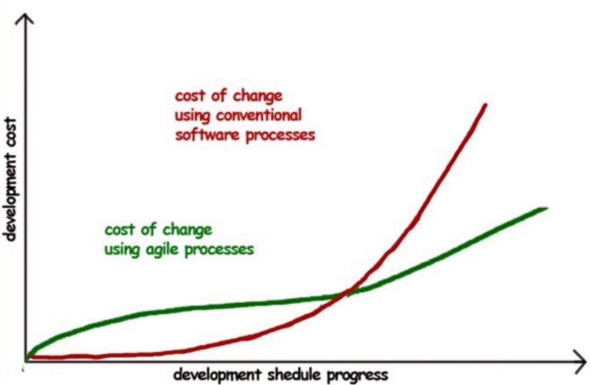

# Ingegneria del Software 2

**Data lezione**: 16.09.2025

**Autori**: Pasqui

**Disclaimer**: non è ancora finito

[back](./../index.md)

# Capitolo 1 - Introduzione al design Agile

## Contesto e motivazioni
Lo sviluppo software tradizionale con i modelli tipo *Waterfall* è spesso inefficace quando i requisiti cambiano rapidamente.
Le principali criticità che hanno motivato la nascita dell'Agile includono:
- Elevato numero di progetti interrotti
- Costi sproporzionati di pianificazione iniziale
- Difficoltà nel rispettare tempi e budget
- Problemi di manutenzione e di adattamento al contesto che evolve più velocemente del software stesso e quindi le aspettative del cliente non saranno soddisfatte.

## Caratteristiche importanti di Agile
- C'è un coinvolgimento continuo del cliente nello sviluppo
- Iterazioni brevi e rilascio frequenti di versioni funzionanti
- Flessibilità ai cambianenti anche nei progetti avanzati
- Focalizzare le priorità alte per il business
- Testing integrato come parte dello sviluppo, non fase finale
- Approccio collaborativo sia nel team che con gli stakeholder

## Fattori differenziati
- Design distribuito: l'attività design non è ridotto ma si fa lungo tutto il progetto. Spesso le implementazioni porta a rivedere cambiare scelte progettuali.
- Evoluzione delle percezioni: Sia i clienti sia il team di sviluppo comprendono meglio le esigenze e soluzioni man mano che il prodotto cresce. (Tipo i clienti possono capire le soluzioni da implementare, i feedback dai test users, nuovi requisiti, ecc. Mentre gli sviluppatori capiscono meglio le necessità del cliente e possono avere una visione più chiara del progetto)

## Agile vs PM classico (Project Management tradizionale)

- PM: Raccolta esaustiva dei requisiti all'inizio. Successo = rispetto di tempi, costi e specifiche
- Agile: I requisiti cambiano nel tempo e i nuovi escono durante lo sviluppo. Successo = Software che risolve i problemi reali del cliente, rispettando i tempi e budget.

## Manifesto Agile
Tenendo conto anche del valore degli elementi sulla destra, consideriamo gli elementi sulla sinistra più importanti.

<table>
  <tr><td><strong>Individuali e interazioni</strong></td><td>processi e strumenti</td></tr>
  <tr><td><strong>Software funzionante</strong></td><td>documentazione esaustiva e comprensibile</td></tr>
  <tr><td><strong>Collaborazione col cliente</strong></td><td>contrattazione</td></tr>
  <tr><td><strong>Risposta al cambiamento</strong></td><td>seguire un piano</td></tr>
</table>

### Principi
I principi del Manifesto Agile non sono le regole rigide ma sono le linee di guida che creano un mindset diverso: valore, collaborazione, qualità e adattabilità.
#### Principio 1 - Soddisfazione del cliente tramite consegne continue
- **Cosa significa**: La massima priorità è soddisfare il cliente con consegne rapide e continue di software di valore.
- **Implicazione**: Non aspettare troppo per la "*versione finale*" ma dare il valore incrementale. 
- **Benificio**: il cliente vede subito i risultati e può correggere la rotta.

#### Principio 2 - Accogliere i cambiamenti anche tardivi
- **Cosa significa**: i requisiti non sono mai "*definitivi*", possono cambiare in qualsiasi fase del progetto.
- **Implicazione**: Il processo deve essere flessibile e adattabile
- **Benificio**: Il software rimane allineato al contesto reale e competitivo del cliente

#### Principio 3 - Rilasci frequenti
- **Cosa significa**: ogni iterazione (da settimane a pochi mesi) deve produrre un incremento utilizzabile.
- **Implicazione**: organizzare cicli di lavoro brevi (sprint, release incrementali).
- **Beneficio**: feedback rapido → correzioni tempestive → rischio ridotto.

#### Principio 4 - Collaborazione costante con cliente
- **Cosa significa**: cliente e team lavorano insieme lungo tutto il progetto, non solo all’inizio e alla fine.
- **Implicazione**: incontri regolari (es. review, demo), scambio continuo di feedback.
- **Beneficio**: il prodotto segue i bisogni reali, non solo documenti di specifica iniziali.

#### Principio 5 - Team motivati e responsabilizzati
- **Cosa significa**: il team è il vero motore del successo; serve fiducia e autonomia decisionale.
- **Implicazione**: creare un ambiente di supporto, fornire risorse, rimuovere ostacoli.
- **Beneficio**: sviluppatori più motivati → maggiore qualità e creatività.

#### Principio 6 - Comunicazione diretta (faccia a faccia)
- **Cosa significa**: la comunicazione più efficace è personale, non tramite documenti o e-mail.
- **Implicazione**: promuovere conversazioni quotidiane, stand-up meeting, pairing.
- **Beneficio**: riduzione dei fraintendimenti e decisioni più rapide.

#### Principio 7 - Software funzionante come misura di progresso
- **Cosa significa**: non contano i documenti, i piani o il numero di attività chiuse: conta ciò che funziona davvero.
- **Implicazione**: definire “done” come software testato, funzionante, pronto all’uso.
- **Beneficio**: si evita la “illusione di progresso” tipica dei modelli tradizionali.

#### Principio 8 - Sviluppo sostenibile
- **Cosa significa**: il ritmo deve essere costante e mantenibile nel lungo periodo, non uno sprint estenuante.
- **Implicazione**: evitare overtime cronico, gestire carichi realistici.
- **Beneficio**: qualità e morale restano alti → meno bug, meno burnout.

#### Principio 9 - Attenzione a eccellenza tecnica e buon design
- **Cosa significa**: qualità interna del codice e dell’architettura non devono mai essere trascurate.
- **Implicazione**: pratiche come refactoring, test automatici, clean code.
- **Beneficio**: codice più semplice da adattare → più agilità nel lungo termine.

#### Principio 10 - Semplicità
- **Cosa significa**: fare solo ciò che serve ora, nella maniera più semplice possibile.
- **Implicazione**: Implementare solo ciò che ha valore immediato.
- **Beneficio**: software più leggero, meno costi di manutenzione, più velocità.

#### Principio 11 - Auto-organizzazione del team
- **Cosa significa**: i team devono avere autonomia per decidere come organizzare il lavoro.
- **Implicazione**: distribuzione orizzontale delle responsabilità, ruoli meno gerarchici.
- **Beneficio**: maggiore senso di ownership, soluzioni più innovative, velocità decisionale.

#### Principio 12 - Miglioramento continuo
- **Cosa significa**: a intervalli regolari il team riflette su come migliorare e si adatta.
- **Implicazione**: retrospettive di sprint, analisi delle pratiche, adattamento costante.
- **Beneficio**: il processo diventa sempre più efficiente e resiliente ai cambiamenti.

